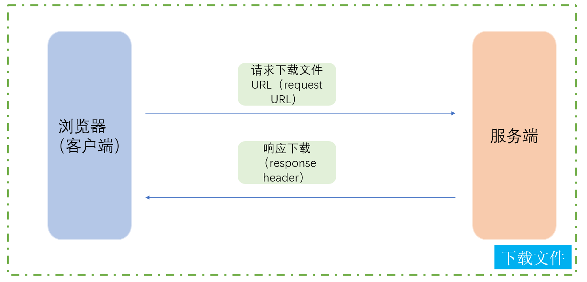
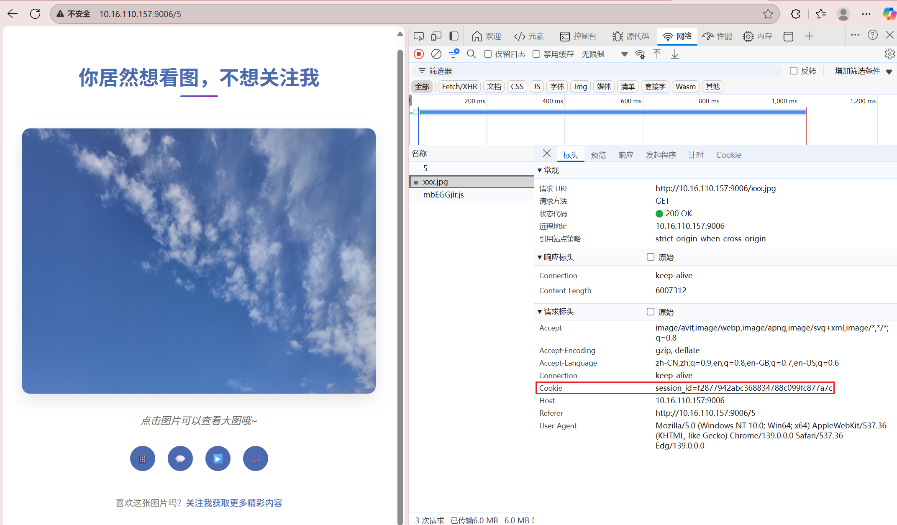

TinyWebServer-v2
===============
Linux下C++轻量级Web服务器，助力初学者快速实践网络编程，搭建属于自己的服务器.[原TinyWebServer源代码下载地址](https://github.com/qinguoyi/TinyWebServer)

前置
===============
其实在对TinyWebServer修改之后是否要开源出来其实是非常纠结的，倒不是说代码开不开源问题，而是TinyWebServer原作者的目的就是想要做一个尽量全而轻量的Web服务器，如果添加上传文件以及下载文件功能之后，会让代码变得更庞大，同时对于初学者或者我们自己在看的时候非常不利，这也违背了TinyWebServer原作者写这个项目的初心。本来是想和原作者沟通是否可以合并到分支里面，但是想了一下还是不要了，这样确实会让代码变得更臃肿和不友好，决定还是另起一个项目，这样大家可以根据自己的需求来学习这个项目。在改进，美化界面以及添加的功能的过程中我是借助了AI的，甚至你用AI可能搜出来的代码和我放在上面的一样。我主要的改进包括使用最小堆将原作者的双向链表给替换了，但是在进行压测的时候其实QPS都差不多；其次是将所有的界面给美化了，这部分需要自己有HTML,CSS,JAVAScript的基础（AI）;最后是添加了上传文件和下载文件的功能。


涉及知识点（来自原文）
===============
* 使用 **线程池 + 非阻塞socket + epoll(ET和LT均实现) + 事件处理(Reactor和模拟Proactor均实现)** 的并发模型
* 使用**状态机**解析HTTP请求报文，支持解析**GET和POST**请求
* 访问服务器数据库实现web端用户**注册、登录**功能，可以请求服务器**图片和视频文件**
* 实现**同步/异步日志系统**，记录服务器运行状态
* 经Webbench压力测试可以实现**上万的并发连接**数据交换


更新日志
============
- [√] 最小堆替换原作者实现的双向链表
- [√] 实现了上传文件功能
- [√] 实现了下载文件功能
- [√] 美化了所有界面
- [√] 服务器生成session id和保存cookie状态，过期时间设置为30分钟
- [x] 浏览器调用摄像头
- [√] 图像分类系统

最小堆
=============
实现堆的过程中主要包含了向上调整堆，向下调整堆，添加节点，删除堆顶节点以及删除指定节点.这里的节点是指定时器，是根据定时器时间大小来进行构建最小堆的，并且保存节点采用的是vector数组以及哈希map来记录当前节点的索引（建议大家直接在网上搜索看资料或者视频更清楚）。

* 向上调整堆：将当前节点对应时间和父节点对应时间进行比较，如果小于父节点的时间就交换，同时哈希map记录的索引也需要交换，因为使用vector数组保存的节点。
* 向下调整堆：将当前节点和其左右子节点的时间进行对比，选择最小的孩子时间节点进行交换，哈希map记录的索引也需要进行交换。
* 添加节点：直接在vector数组最后添加节点，同时哈希map记录索引，最后调用向上调整函数调整堆即可。
* 删除堆顶节点：如果直接删除堆顶节点比较复杂，因此将堆顶节点和最后一个节点进行交换，删除最后一个节点，同时调用向下调整函数即可恢复最小堆结构。
* 删除指定节点：如果直接删除指定节点比较麻烦，和删除堆顶节点一样，将其和最后一个节点进行交换，并删除最后一个节点，同时从删除当前节点位置调用向下和向上调整函数即可恢复最小堆结构。

上传文件
=============
上传文件时需要注意的问题比较多，具体实现大家可以看源代码，主要问题如下：

* 原作者实现的代码对于请求body部分大小是有限的，如果直接对其缓冲区大小进行调整，将报错std::bad_alloc，因此对于稍微小的文件可以一次请求成功，但是对于稍微大一点的，比如1KB就会上传失败。
* 为了实现上传稍微大一点的文件，这里采用比较粗暴的形式，既然一次上传不完所有文件内容，那么可以分批次请求上传文件内容，然后将所有上传的内容进行合并得到完整的文件内容，这是目前的实现方式，同时也会将分块保存的文件给删除掉。
* 除了后端逻辑实现部分之外，还需要注意前端部分的实现，哪怕借助AI也需要非常小心和大量的调整。
* 前端部分除了实现upload.html页面之外，还需要考虑分块上传文件的过程，这部分涉及HTML,CSS以及JavaScript知识点，大家可以去了解一下，我也边写同时借助AI来了解。


下载文件
=============
下载文件的实现相比上传文件要简洁的多，当然并不代表简单，如下问题：

* 这部分首先需要实现download.html前端部分的网页，实现的过程中需要考虑怎么将服务器部分要下载的文件显示到前端，那么就需要我们在点击进入下载页面的时候，向服务器发送请求，服务器会把可以下载的文件列表通过响应的方式给浏览器（客户端），浏览器接收之后就可以将内容显示出来，当然这部分还是涉及大量的HTML,CSS以及JavaScript的知识点，但是并不妨碍我们理解后端的逻辑。
* 点击要下载的文件时，浏览器向服务端发送请求，服务端将要下载的文件通过响应的方式发送浏览器，注意这里有一个字段Content-Disposition要非常小心，Content-Disposition是 HTTP 响应头中的一个重要字段，主要用于控制客户端（如浏览器）如何处理服务器返回的内容，特别是在文件下载场景。
* Content-Disposition添加的时序位置也是有要求的，如果添加的时机不对，也会导致失败（主要是自己的经验不足，导致踩坑）：
```
// HTTP响应的标准格式
HTTP/1.1 200 OK                    // 状态行
Content-Type: text/html            // 响应头
Content-Length: 1234               // 响应头
Content-Disposition: attachment    // 响应头
                                    // 空行
&lt;html&gt;...&lt;/html&gt;        // 响应体
```




关于操作视频演示动画，请看：https://blog.csdn.net/Keep_Trying_Go/article/details/150215367


服务器生成session id和保存cookie状态
=================
Cookie​​ 是存储在​​客户端​​（浏览器）的小型文本数据（通常有大小限制，如4KB）
​​Session​​ 是存储在​​服务端​​的用户状态信息（大小理论上只受服务器内存限制）
它们通常​​配合使用​​，形成这样的工作流程：

* 用户首次访问 → 服务端创建Session并生成唯一Session ID
* 服务端通过Set-Cookie将Session ID发送给浏览器
* 浏览器后续请求自动携带这个Cookie（Session ID）
* 服务端通过Session ID查找对应的Session数据




编译OpenCV4.5.5
=========================
下载依赖库
-------------------------
```
sudo apt update && sudo apt upgrade -y
```

安装编译器和构建工具

```
sudo apt install -y build-essential cmake git pkg-config libgtk-3-dev
```

安装图像和视频库

```
sudo apt install -y libavcodec-dev libavformat-dev libswscale-dev libv4l-dev libxvidcore-dev libx264-dev

sudo apt install -y libjpeg-dev libpng-dev libtiff-dev gfortran openexr libatlas-base-dev
```

安装可选依赖（强烈推荐）

```
sudo apt install -y libtbb2 libtbb-dev libdc1394-22-dev libopenexr-dev
```

源码下载和编译
-------------------
opencv官网：
https://github.com/opencv
https://opencv.org/releases/page/2/

OpenCV4.5.5下载：https://github.com/opencv/opencv/tree/4.5.5

OpenCV-Contrib4.5.5（contrib 包含额外的模块）下载：https://github.com/opencv/opencv_contrib/tree/4.5.5

注：下载之后将其上传指定的服务器（位置随便），然后进行解压unzip 文件名.zip

第一步：CMake配置构建
```
cmake -D CMAKE_BUILD_TYPE=RELEASE \
      -D CMAKE_INSTALL_PREFIX=/usr/local \
      -D INSTALL_C_EXAMPLES=ON \
      -D INSTALL_PYTHON_EXAMPLES=ON \
      -D OPENCV_GENERATE_PKGCONFIG=ON \ 
      -D OPENCV_EXTRA_MODULES_PATH=/home/ubuntu/Documents/KTG/myPro/myProject/myTinyWebServer-v2/opencv_build/opencv_contrib/modules \
      -D BUILD_EXAMPLES=ON \ 
      -D WITH_GTK=ON \
      -D WITH_FFMPEG=ON \ 
      -D BUILD_opencv_python3=ON \
      -D BUILD_opencv_python2=OFF \
      ..
```

第二步：编译

开始编译，使用所有可用的CPU核心:
```
make -j$(nproc)
```

第三步：安装

编译完成后，安装到系统目录 (需要sudo权限):
```
sudo make install
```

最后，更新动态链接库缓存：
```
sudo ldconfig
```

验证OpenCV是否安装成功：
```
pkg-config --modversion opencv4
# 如果成功，应该输出 4.5.5
```
[Linux下编写C++程序导入opencv编译并执行的几种方式（Linux/C++/OpenCV）](https://mydreamambitious.blog.csdn.net/article/details/148350287?spm=1011.2415.3001.5331)

Webbench压测
=============
原理:
父进程fork若干个子进程，每个子进程在用户要求时间或默认的时间内对目标web循环发出实际访问请求，父子进程通过管道进行通信，子进程通过管道写端向父进程传递在若干次请求访问完毕后记录到的总信息，父进程通过管道读端读取子进程发来的相关信息，子进程在时间到后结束，父进程在所有子进程退出后统计并给用户显示最后的测试结果，然后退出。

下载并编译 
-----------
wget http://home.tiscali.cz/~cz210552/distfiles/webbench-1.5.tar.gz

解压：tar zxvf webbench-1.5.tar.gz 

切换目录：cd webbench-1.5 

编译：make 

安装：sudo make install

注意：目前1.5版本的webbench支持http协议，不支持https协议。


开始压测
-------------
webbench -c 10500 -t 5 http://10.16.110.157:9006/

模式1 proactor + LT + LT：./server -m 0 -c 1 -a 0

Speed=4317024 pages/min, 8058445 bytes/sec.
Requests: 359752 susceed, 0 failed.

模式2 proactor + LT + ET：./server -m 1 -c 1 -a 0

Speed=4208976 pages/min, 7856733 bytes/sec.
Requests: 350748 susceed, 0 failed.

模式3 proactor + ET + LT：./server -m 2 -c 1 -a 0

Speed=4085856 pages/min, 7636944 bytes/sec.
Requests: 340485 susceed, 3 failed.


模式4 proactor + ET + ET：./server -m 3 -c 1 -a 0

Speed=3805128 pages/min, 7113030 bytes/sec.
Requests: 317091 susceed, 3 failed.

模式5 reactor  + LT + ET：./server -m 1 -c 1 -a 1

Speed=2533716 pages/min, 4729760 bytes/sec.
Requests: 211143 susceed, 0 failed.

和原作者测试的结果比起来结果还变差了，我感觉改进的最小堆思路应该是没有什么问题，可能是没有做什么优化，我在实现最小那部分的时候对于构建堆，删除元素以及堆的调整都是采用原始堆的思想，完全没有做什么性能上的优化，但是可以给大家提供一个思路去学习。

参考链接
-----------------
[QT 6.6.0 基于OpenCV加载.pth模型文件转换之后的ONNX模型文件，并且实现图像分类](https://mydreamambitious.blog.csdn.net/article/details/141180470?spm=1011.2415.3001.5331)

[QT 6.6.0 基于OpenCV中的cv::dnn::ClassificationModel实现图像分类](https://mydreamambitious.blog.csdn.net/article/details/141230843?spm=1011.2415.3001.5331)

[yolov5目标检测和QT 6.6.0 基于OpenCV加载yolov5.onnx模型文件实现目标检测](https://mydreamambitious.blog.csdn.net/article/details/141291726?spm=1011.2415.3001.5331)

[FCN图像分割和QT 6.6.0 加载分割FCN_Resnet50.ONNX模型文件进行图像分割（过程详解）](https://mydreamambitious.blog.csdn.net/article/details/141304048?spm=1011.2415.3001.5331)


庖丁解牛（来自原文）
------------
近期版本迭代较快，以下内容多以旧版本(raw_version)代码为蓝本进行详解.

* [小白视角：一文读懂社长的TinyWebServer](https://huixxi.github.io/2020/06/02/%E5%B0%8F%E7%99%BD%E8%A7%86%E8%A7%92%EF%BC%9A%E4%B8%80%E6%96%87%E8%AF%BB%E6%87%82%E7%A4%BE%E9%95%BF%E7%9A%84TinyWebServer/#more)
* [最新版Web服务器项目详解 - 01 线程同步机制封装类](https://mp.weixin.qq.com/s?__biz=MzAxNzU2MzcwMw==&mid=2649274278&idx=3&sn=5840ff698e3f963c7855d702e842ec47&chksm=83ffbefeb48837e86fed9754986bca6db364a6fe2e2923549a378e8e5dec6e3cf732cdb198e2&scene=0&xtrack=1#rd)
* [最新版Web服务器项目详解 - 02 半同步半反应堆线程池（上）](https://mp.weixin.qq.com/s?__biz=MzAxNzU2MzcwMw==&mid=2649274278&idx=4&sn=caa323faf0c51d882453c0e0c6a62282&chksm=83ffbefeb48837e841a6dbff292217475d9075e91cbe14042ad6e55b87437dcd01e6d9219e7d&scene=0&xtrack=1#rd)
* [最新版Web服务器项目详解 - 03 半同步半反应堆线程池（下）](https://mp.weixin.qq.com/s/PB8vMwi8sB4Jw3WzAKpWOQ)
* [最新版Web服务器项目详解 - 04 http连接处理（上）](https://mp.weixin.qq.com/s/BfnNl-3jc_x5WPrWEJGdzQ)
* [最新版Web服务器项目详解 - 05 http连接处理（中）](https://mp.weixin.qq.com/s/wAQHU-QZiRt1VACMZZjNlw)
* [最新版Web服务器项目详解 - 06 http连接处理（下）](https://mp.weixin.qq.com/s/451xNaSFHxcxfKlPBV3OCg)
* [最新版Web服务器项目详解 - 07 定时器处理非活动连接（上）](https://mp.weixin.qq.com/s/mmXLqh_NywhBXJvI45hchA)
* [最新版Web服务器项目详解 - 08 定时器处理非活动连接（下）](https://mp.weixin.qq.com/s/fb_OUnlV1SGuOUdrGrzVgg)
* [最新版Web服务器项目详解 - 09 日志系统（上）](https://mp.weixin.qq.com/s/IWAlPzVDkR2ZRI5iirEfCg)
* [最新版Web服务器项目详解 - 10 日志系统（下）](https://mp.weixin.qq.com/s/f-ujwFyCe1LZa3EB561ehA)
* [最新版Web服务器项目详解 - 11 数据库连接池](https://mp.weixin.qq.com/s?__biz=MzAxNzU2MzcwMw==&mid=2649274326&idx=1&sn=5af78e2bf6552c46ae9ab2aa22faf839&chksm=83ffbe8eb4883798c3abb82ddd124c8100a39ef41ab8d04abe42d344067d5e1ac1b0cac9d9a3&token=1450918099&lang=zh_CN#rd)
* [最新版Web服务器项目详解 - 12 注册登录](https://mp.weixin.qq.com/s?__biz=MzAxNzU2MzcwMw==&mid=2649274431&idx=4&sn=7595a70f06a79cb7abaebcd939e0cbee&chksm=83ffb167b4883871ce110aeb23e04acf835ef41016517247263a2c3ab6f8e615607858127ea6&token=1686112912&lang=zh_CN#rd)
* [最新版Web服务器项目详解 - 13 踩坑与面试题](https://mp.weixin.qq.com/s?__biz=MzAxNzU2MzcwMw==&mid=2649274431&idx=1&sn=2dd28c92f5d9704a57c001a3d2630b69&chksm=83ffb167b48838715810b27b8f8b9a576023ee5c08a8e5d91df5baf396732de51268d1bf2a4e&token=1686112912&lang=zh_CN#rd)

CPP11实现
------------
更简洁，更优雅的CPP11实现：[Webserver](https://github.com/markparticle/WebServer)


致谢
------------
Linux高性能服务器编程，游双著.

感谢[qinguoyi](https://github.com/qinguoyi/TinyWebServer)提供的TinyWebServer，让我学习到了很多知识点，也希望我给出的能给大家带来收益。
